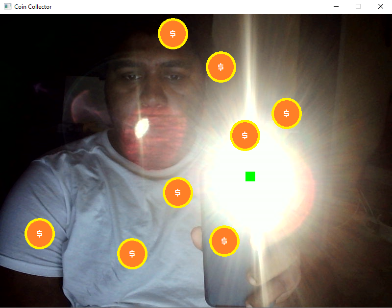

# SDL and OpenCV Image Processing

I was inspired by the Intelligent Signal Processing course at the final year of University of London. The original examples were done in Javascript and the Python version of OpenCV. I decided to try using C++ and SDL2 as a proof of concept of integration of the two.

Of my own accord, I made a little game that allows you to collect coins using a light source (like your phone light).

Use the following options in your build step to get SDL working.

DSDL2_DIR="path/to/sdl2/cmake" 
DSDL2_IMAGE_LIBRARIES="path/to/sdl2_image/libfile"
DSDL2IMAGE_INCLUDE_DIRS="path/to/sdl2_image/include"

Good luck figuring that part out.

